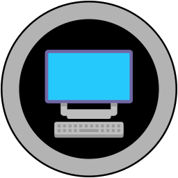

Remote Desktop (kclient)
========================



kclient integration to set up remote desktop access for VS Code


## Installation

### VS Code


### .devcontainer

To add this to a devcontainer, you add the following to the `devcontainer.json`

```json
    "customizations": {
        "vscode": {
            "extensions": [
                ...,
                "gbraad.rdesktop-kclient"
            ]
        }
    }
```


Authors
-------

| [](https://gbraad.nl "Gerard Braad <me@gbraad.nl>") |
|---|
| [@gbraad](https://gbraad.nl/social)  |
